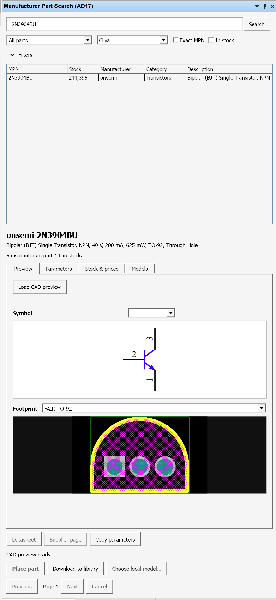
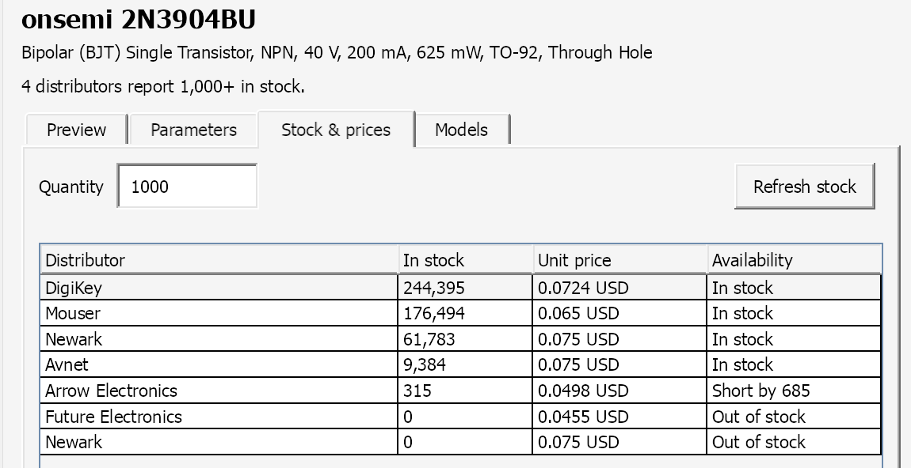

# Altium 17 MPS

An Altium plugin that backports Manufacturer Part Search to Altium Designer 17.

- Dockable panel in AD17's bottom-right **System** menu.
- Category browsing, sortable results, parameter filters and datasheets.
- Distributor stock and quantity pricing, with refresh through Altium's supplier data.
- Schematic symbol and footprint previews, including multipart symbols.
- **Place part** downloads matching CAD from Altium Vaults and attaches the symbol to your schematic cursor. Undo/redo works normally.
- Fixes Ciiva lookup, supplier links and local footprint/3D model links.

Tested in **Altium Designer 17.1 under Wine**. Uses Altium's existing login; CAD models must be available in a connected Vault.




## Install

Download **Altium-17-MPS-Setup.exe** from the [release](https://github.com/lazy-jubei/Altium-17-MPS/releases/latest). Close AD17, run the installer in Windows or your AD17 Wine prefix, and click **Install**. No PowerShell is needed.

Restart Altium, then choose **System → Manufacturer Part Search (AD17)** at the bottom right. File and Tools shortcuts are also available. Drag the panel to dock it beside your schematic.

Search or choose a category, select a part, preview its CAD and click **Place part**. If several revisions match, choose one in **Models**. **Choose local model** supports installed libraries. The ZIP includes manual installers.

Output is `Documents/AltiumParts/ManufacturerParts.schlib`; `ALTIUM_PART_SEARCH_LIBRARY_DIR` overrides it. Keep the source libraries or Altium's Vault cache for linked models.

## Build

Requires .NET SDK 8 or later and AD17's SDK assemblies. The plugin targets .NET Framework 4.8/x86; Altium DLLs are not bundled.

```powershell
.\Build.ps1 -AltiumInstallDir 'C:\Program Files (x86)\Altium\AD17'
.\Package.ps1
```

On macOS: `./tools/build-macos.sh`, then `pwsh -File Package.ps1`.
Manual installers accept `-ExtensionsRoot` or `--extensions-root` to select an installation.

Based on [expired6978/EasyEDALoader](https://github.com/expired6978/EasyEDALoader) and the AD17 work in its fork. Runtime errors are logged to `%LOCALAPPDATA%\Altium17PartSearch\runtime-errors.log`.
